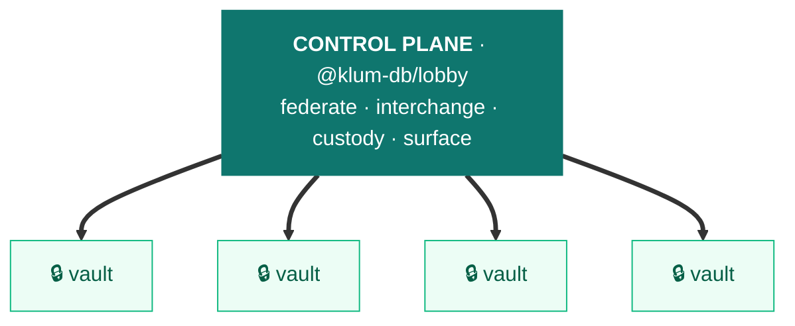

# @klum-db/lobby

> **Small enough to own, coordinated enough to scale.**
> `@klum-db/lobby` is the **control plane** for a fleet of sovereign [noy-db](https://github.com/vLannaAi/noy-db) vaults. Each vault is small, **100%-encrypted**, and complete on its own — its own embedded schema, its own query engine, usable **offline**. The Lobby orchestrates many into one coordinated whole, **online or offline**: **coordination without custody** — it drives the fleet but never owns the data. *One-way — klum drives noy; noy never knows klum exists.*

`@klum-db/lobby` · status: **preview** · depends on `@noy-db/hub`

---

## What it is, in 20 seconds

A single vault is complete — its own keys, schema, and truth — but completeness is also a ceiling: alone, a vault can only answer for *itself*. The usual fix is to pour everything into one central store, trading away the sovereignty that made each vault worth trusting. **The Lobby takes the other path — it coordinates the vaults where they stand.**



*DATA PLANE · `@noy-db/hub` — each vault sovereign & 100% encrypted, complete on its own. **klum drives noy one-way; noy never depends on klum.***

<details><summary>Text version (npm / non-Mermaid viewers)</summary>

```
  ┌────────────────────────────────────────────────────┐
  │  CONTROL PLANE · @klum-db/lobby                      │
  │  federate · interchange · custody · surface         │
  └────────────────────────┬───────────────────────────┘
                           │ drives — one-way (klum → noy)
        ┌──────────┬───────┴───────┬──────────┐
        ▼          ▼               ▼          ▼
     ┌──────┐   ┌──────┐        ┌──────┐   ┌──────┐
     │vault │   │vault │        │vault │   │vault │
     └──────┘   └──────┘        └──────┘   └──────┘
  DATA PLANE · @noy-db/hub — each vault sovereign & non-fungible,
  complete on its own.  noy never depends on klum.
```
</details>

- **Coordination without custody.** klum drives the fleet — federate, move data, custody, sync — but **never owns the data**: keys, crypto, and records stay sovereign in each vault, and klum binds to one stable contract (`@noy-db/hub/kernel`), never hub internals. *(One-way, and enforced — a build-time guard means no `@noy-db` package can ever import `@klum-db`.)*
- **Bring the work to the data, not the data to a lake.** Cross-vault queries resolve *across* the group — each vault answers for its own slice under its own keys, nothing pools. No central honeypot to breach.
- **Small core, coordinated reach.** Each vault stays small, portable, and individually revocable; orchestration recovers the cross-cutting reach you'd otherwise need a monolith for.
- **A group, not a cluster.** Vaults are sovereign and non-fungible — one subject = one vault, the subject holds the deed. *Joined, not merged; allied, not absorbed.* (Thai *klum* กลุ่ม = a group.)

## Why it exists

Banking, accounting, health, insurance — the data that matters is **individual, single-subject, and owned by the person it's about**. noy-db makes each of those a small, sovereign, **100%-encrypted** vault — a complete system on its own. *You own your data, in spite of the cloud.* The limit only bites when one actor must work across **many** subjects at once.

That's the Lobby's dimension: the efficiency and privacy of a small sovereign dataset at the core, joined with an actor operating across many at once — **governance by default, not by checklist**. Access is **scoped, purpose-limited, and revocable** (the subject can withdraw anytime); the orchestrator coordinates without absorbing. A counterweight to the central data lake — without the lock-in, the lock-out, or the single honeypot.

**Lineage & market context:** klum-db sits in the local-first / data-sovereignty tradition — [Local-first software](https://www.inkandswitch.com/essay/local-first/), [GDPR data portability](https://gdpr-info.eu/art-20-gdpr/), and the full picture in [**docs/positioning.md**](docs/positioning.md).

## Reads in a sentence

> A firm is a **Custodian** in the **Lobby**: it holds operating grants to client **Vaults** that all reference one shared **Pool**. The client holds the **Deed**. To onboard, the firm **Relocates** a client's vault as a **Bundle**, **Migrates** it to the current schema, and **Merges** the Pool slice by field **Authority** using **Provenance**. The client can **Withdraw** anytime; an abandoned vault can be **Liberated**.

Every bold word is a real, shipped capability.

## Install

```bash
pnpm add @klum-db/lobby @noy-db/hub
```

```ts
import { createNoydb } from '@noy-db/hub'
import { memory } from '@noy-db/to-memory'
import { createLobby } from '@klum-db/lobby'

const db = await createNoydb({ store: memory(), user: 'firm', secret: '…' })
const lobby = createLobby(db)
```

---

## The four pillars

### 1 · Federation — operate many vaults as a fleet

A `VaultGroup` shards one logical dataset across per-entity vaults (one client = one vault), with cross-shard queries, firm-wide **Insight** rollups (zero client data crosses a DEK boundary), and a resumable **fleet schema-migration** runner.

```ts
lobby.withVaultTemplate('client', { version: 1, configure: v => v.collection('invoices') })
const group = await lobby.openVaultGroup('clients', { registry, sharding: { keyOf, vaultTemplate: 'client', autoCreate: true } })
await group.shard('acme-co').collection('invoices').put('i1', { id: 'i1', total: '1200.00' })
const all = await group.queryAcross(/* … */)          // fan-out read across shards
await group.rolloutSchema({ batchSize: 4 })             // resumable, registry-tracked
```

### 2 · Interchange — move data between vaults, safely

The full onboarding spine — **Relocate → Migrate → Merge by Authority using Provenance** — composes cleanly:

```ts
// FR-2 — Relocate: extract an FK-closed slice across vaults into one bundle
const { bundle, transferKeys } = await extractCrossVaultPartition(openVault, { seed, crossVaultRefs })

// FR-8 — Migrate-then-merge: upgrade an older-schema bundle in staging, THEN merge
const report = await migrateThenMerge(receiver, compartmentBytes, {
  transferKey, fromVersion: 0, toVersion: 1,
  migrations: { clients: [{ toVersion: 1, transform: splitFullName }] },
  strategy: 'field-authority',
  fieldAuthority: { clients: { juristicName: { authority: 'source-newest' }, nickname: { authority: 'owner', ownerSource: 'client' } } },
})
```

| Capability | What it does | API |
|---|---|---|
| **Bundle** (FR-1) | Multi-compartment `.noydb` container + pre-decrypt manifest | `@noy-db/hub/bundle` · `writeMultiVaultBundle` |
| **Relocate** (FR-2) | Cross-vault FK-closure extraction → bundle | `extractCrossVaultPartition` / `walkCrossVaultClosure` |
| **Merge** (FR-3) | Reconcile a compartment into an existing vault | `mergeCompartment` |
| **Authority** (FR-4) | Per-**field** conflict resolution (registry-newest vs owner) | `resolveFieldAuthority` · `strategy: 'field-authority'` |
| **Provenance** (FR-5) | `_source`/`_sourceTs` on writes, preserved through merge | `collection({ provenance: true })` · `getMetadata` |
| **Migrate** (FR-8) | Upgrade an incoming bundle to the receiver schema in staging | `migrateThenMerge` |
| **Export** (FR-9) | Multi-vault Excel: primary sheet + FK-referenced supporting rows | `lobby.exportMultiVaultXlsx` |

```ts
// FR-9 — one workbook spanning a client shard + the shared directory (only referenced rows)
const xlsx = await lobby.exportMultiVaultXlsx({
  primary: { vault: 'acme', seeds: { bills: () => true } },
  crossVaultRefs: [{ from: { collection: 'bills', field: 'entityId' }, to: { vault: 'directory', collection: 'entities' } }],
  sheets: { acme: [{ name: 'bills', collection: 'bills', denormalize: [{ column: 'entityName', localField: 'entityId', from: { label: 'directory', collection: 'entities', keyField: 'id', pick: 'name' } }] }],
            directory: [{ name: 'entities', collection: 'entities' }] },
})
```

### 3 · Custody — sovereign ownership without lock-in (FR-6)

The client holds an **inalienable, sealed, hidden owner** (the **Deed**) from day one; the firm operates at **100%** as a **Custodian** that *provably cannot* take ownership; an abandoned vault can be **Liberated** under an audited ceremony (the inverse of withdrawal). Inalienability is **cryptographic** — the Custodian holds the data keys but never the owner credential (sealed under a non-firm boundary).

```ts
import { createDeedOwner } from '@klum-db/lobby'              // re-exported from @noy-db/hub

await createDeedOwner(store, 'acme', 'client-acme', clientSealingProvider)   // latent owner, never authenticates
await db.grantCustodian('acme', { userId: 'firm', displayName: 'Firm', passphrase: '…' })
//  firm now operates fully — but grant / revoke / rotate / extract-and-sever all throw for a custodian
await vault.custody.liberate({ newOwnerId: 'firm-owner', newOwnerPassphrase: '…', legalBasis: 'contractual-handover' })
```

### 4 · Surface — sync only an agreed slice (FR-7)

A **Surface** is a persisted, bilaterally-agreed subset two parties sync: `{ collections, fields?, direction, conflictPolicy, cadence }`. Collections and fields **outside the surface never leave the vault** (structural projection at the export boundary).

```ts
const surface = await proposeSurface(smvA, { collections: ['compensations'], fields: { compensations: ['period', 'pnd1', 'sso'] }, direction: 'push', conflictPolicy: { strategy: 'lww-by-ts' }, cadenceMs: MONTH }, 'payroll', Date.now())
await agreeSurface(smvB, surface.id, 'tax-agent', Date.now())
const { bundleBytes, transferKey } = await lobby.exportSurface('payroll-vault', surface)   // only the 3 named fields leave
await lobby.applySurface('tax-vault', surface, bundleBytes, transferKey)
```

### On-ramp · Dock → `graduate()`

A foreign, non-noy-db unit (a legacy DB, a raw export) can't be federated directly — the sovereign tier needs a vault's keyring and per-record keys. **Dock** carries it read-only at a lower tier; **`graduate()`** imports it into a fresh sovereign vault, unlocking the full tier (custody, provenance, field-Authority merge). It's the one move that *adds a node to the data plane* rather than coordinating existing ones.

---

## Relationship with noy-db

The one-way law and the kernel seam are covered up top — here are the specifics that matter when you build:

- **Custody is a vault-level concern** and lives *in* hub (keyring/CEK/consent primitives); the Lobby **re-exports** it (`createDeedOwner`, `liberateVault`, `CustodyApi`) so consumers have one import surface.
- **Federation** lives in the Lobby, not in hub — open fleets with `lobby.openVaultGroup` (`@noy-db/hub` no longer ships the `openVaultGroup` / `openStateManagementVault` / `withVaultTemplate` fleet methods).
- **Enforced, not conventional:** an `@noy-db` package importing `@klum-db` fails noy-db's build-time architecture check.

## Status

Preview. `@klum-db/lobby` is its own repository and the sole publisher of `@klum-db/*` to npm. It depends on the **published** `@noy-db/*` packages through the stable `@noy-db/hub/kernel` boundary and versions **independently** (`0.2.0-pre.N`, decoupled from noy-db). Pilot-1 (FR-1…FR-9), the dock tier, and `Lobby.graduate()` are complete.

See [`docs/architecture.md`](docs/architecture.md) for the detailed noy-db ↔ klum-db boundary, [`docs/roadmap.md`](docs/roadmap.md) for what's next, and [`PROVENANCE.md`](./PROVENANCE.md) for origin and build history.
