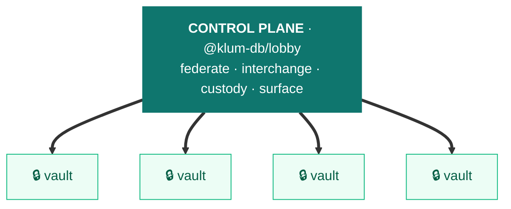

# Architecture — the noy-db ↔ klum-db boundary

The canonical, detailed description of how `@klum-db/lobby` relates to `@noy-db`. The [README](../README.md) is the concise intro; this is the deep dive. (Origin/history: [PROVENANCE.md](../PROVENANCE.md).)

## The shape in one picture — control plane / data plane

`@klum-db/lobby` is the **control plane** for a fleet of sovereign `@noy-db` vaults; each vault is the **data plane**. A control plane coordinates the fleet but *never owns the data plane's data* — which is exactly the klum→noy law: custody, crypto, and records stay sovereign in each vault.

*`@noy-db/hub` data plane — **klum drives noy one-way; noy never depends on klum.***

The vaults are a **group, not a cluster** — sovereign and non-fungible (one subject = one vault, the subject holds the deed). *(If Docker→Kubernetes is your reference: the same one-over-many shape, but the units are sovereign, not fungible replicas.)* The two axes below — inward vs outward — are that same boundary, named from the vault's point of view.

## Two axes, one direction

| | **`@noy-db/hub`** — *inward* | **`@klum-db/lobby`** — *outward* |
|---|---|---|
| Owns | **one** sovereign vault | a **group** of vaults |
| Concern | a vault's own data, crypto, concurrency, consistency | coordination *across* vaults / stores / parties / lifecycle |
| Analogy | a container | the engine that orchestrates many containers |
| Complete alone? | **yes** — a vault + a store is a whole system | no — it exists to operate across many vaults |

The dependency runs **one way**: `@klum-db/lobby` → `@noy-db/hub`. No `@noy-db` package ever imports `@klum-db` (enforced by noy-db's build-time `no-outbound-klum-import` guard — absolute, no allowlist). That asymmetry is the whole design: a vault must never need the Lobby to be complete.

## The seam — klum binds only to the published `@noy-db/hub/kernel`

klum depends on **published** `@noy-db` packages (never a workspace link, never hub internals), and binds to one stable contract subpath: **`@noy-db/hub/kernel`**. What that contract carries:

- **Runtime helpers:** `generateULID`, `sha256Hex`, plus the quorum/barrier primitives `isQuorum` / `runDrainBarrier` (added in #469).
- **Error classes** (so consumers `instanceof` them from klum): `ValidationError`, `ReservedVaultNameError`, `VaultTemplateNotFoundError`, `CrossShardJoinError`, `UnknownShardError`, `ShardProvisioningError`, `DataResidencyError`, `NoAccessError`.
- **Type-only** (erased at emit; klum cannot `instanceof` these): `Vault`, `Collection`, `Noydb`, `Query`, `LiveQuery`, `Operator`, `JoinStrategy`, `AggregateResult`/`AggregateSpec`/`LiveAggregation`, `ChangeEvent`, `IndexDef`, plus the new coordination port types `CoordinationProvider`/`WriterPresence`/`FenceState`/`DrainBarrierOptions`. And `Noydb.isClosed`.

The kernel is **additive-only** — removing anything is a breaking change requiring a coordinated bump on both repos. klum also consumes `@noy-db/hub` (root + `/bundle`) and `@noy-db/as-xlsx` for the single-vault primitives it composes (the `.noydb` bundle read/write, `extractPartition`, `decryptExtractedPartition`, the single-vault xlsx export).

## The boundary law — deciding what goes where

> **A capability is the Lobby's only when coordination spans multiple vaults / stores / parties AND can be expressed as choreography over noy-db's *public* primitives. A concern contained within one vault's own data, crypto, or concurrency stays in the vault — even when distinct parties are involved — because its crypto is inherently that one vault's.**

The deciding line is the **vault/store boundary**, not the actor count. Worked examples:

- **Federation / cross-shard join / fleet rollout** → klum. Spans N vaults; expressed over `db.openVault` + public query/bundle primitives.
- **Multivault (NDBM) bundle** → klum. Pure composition: frames N single-vault `.noydb` bundles, touches no crypto.
- **Custody (Deed/Custodian/Liberate), two-party withdrawal, managed transfer/adopt** → **stay in noy**. These look cross-party, but they re-wrap a *single* vault's DEKs (`wrapKey`/`createOwnerKeyring`/`resolveManagedSecret`) — crypto primitives that can't leave hub's encapsulation. The "parties" are principals in *one* vault's keyring. klum **re-exports** custody (`createDeedOwner`/`liberateVault`/`CustodyApi`) so consumers have one import surface, but the implementation is noy's.
- **Single-vault schema cutover** (the drain-barrier) → **stays in noy** as concurrency control, *but* its transport is now an injected kernel port (#469) that klum drives across a fleet. See the next section.

## The recurring pattern — dependency-inversion ports

The deepest structural fact: **the Lobby drives noy-db's behavior through injected *ports* on the `Noydb` handle, without ever naming the package that implements them.** This is the same seam, three times:

| Port (kernel-defined) | Implemented by (app injects) | The Lobby's role |
|---|---|---|
| `NoydbStore` | `@noy-db/to-*` (postgres, s3, idb, memory…) | reads/writes vaults over whatever store the app wired |
| `SealingKeyProvider` | `@noy-db/at-*` (aws-kms, macos-keychain, env…) | seals/unseals via whatever provider the app wired |
| **`CoordinationProvider`** (#469, shipped `@noy-db@pre.27`) | `@noy-db/by-tabs` / `@noy-db/by-peer` (real-time) — or the in-hub store-polling default | drives a **fleet drain-barrier** over live writers, never importing `by-*` |

The app is the composition root: it injects the concrete implementation into `createNoydb`, and the Lobby reaches it polymorphically through the handle. The dependency arrow inverts — `by-* → kernel ← klum` — so klum stays transport-agnostic. **This is why klum can fence a multi-vault schema cutover over multiple browser tabs / LAN peers without a `by-*` dependency** (the klum-side orchestrator is [roadmap §1](./roadmap.md)).

## What lives where

| Lives in **klum** (`@klum-db/lobby`) | Lives in **noy** (`@noy-db/*`) |
|---|---|
| `VaultGroup`, sharding, `crossShardJoin`, Insight Vault, StateManagement Vault | the `Vault` / `Collection` / record / field model |
| Fleet rollout (`rolloutSchema` / `cutoverShard`) — *orchestration* | per-vault schema **Cutover** (the drain-barrier mechanism) + the **Transform** |
| Multivault (NDBM) bundle (`writeMultiVaultBundle` / readers) | single-vault `.noydb` bundle (`writeNoydbBundle`), `extractPartition` |
| Cross-vault extraction / `mergeCompartment` / `migrateThenMerge` | keyring, per-record CEK, sealing, withdrawal, **custody impl** |
| Surface (scoped sync), Dock → `graduate()` | the **coordination port** + `by-tabs`/`by-peer` real-time impls |
| Group tooling adapters (`groupInspector`, `meterGroup`, the `klum` CLI) | the dev-tools / meter contracts these adapt to (`@noy-db/in-devtools`) |
| Multi-vault xlsx export (`exportMultiVaultXlsx`) | single-vault xlsx (`@noy-db/as-xlsx`) |

Migration vocabulary (Transform → Cutover → Rollout) is in [`docs/glossary/schema-migration.md`](./glossary/schema-migration.md), mirrored in noy-db.

## Reconciling the names — FR-numbers and `src/` folders

Two internal taxonomies pre-date the four-pillar spine; this is where they map, so the names never compete with the front-door model.

**FR-1…FR-9 → pillar** (the pilot numbering; the FR pilot *was* the Interchange/Custody/Surface slice, which is why it doesn't cover Federation or Dock):

| FR | Capability | Pillar |
|---|---|---|
| FR-1 | Multi-compartment bundle (NDBM) | Interchange |
| FR-2 | Relocate (cross-vault FK-closure extraction) | Interchange |
| FR-3 | Merge / `mergeCompartment` | Interchange |
| FR-4 | Field-Authority conflict resolution | Interchange |
| FR-5 | Provenance (`_source`/`_sourceTs`) | Interchange *(noy-side primitive)* |
| FR-6 | Custody (Deed / Custodian / Liberate) | Custody *(re-export)* |
| FR-7 | Surface / scoped sync | Surface |
| FR-8 | Migrate-then-merge | Interchange |
| FR-9 | Multi-vault FK-driven xlsx export | Interchange |
| — | `VaultGroup`, cross-shard, Insight, rollout | Federation *(pre-dates the FR pilot)* |
| — | Dock → `graduate()` | Dock on-ramp |

**`src/` folder → pillar** (the folders don't rename to the pillars — this map explains the layout):

| Folder | Pillar |
|---|---|
| `src/federation/` | Federation |
| `src/interchange/` | Interchange (+ `surface.ts` → Surface) |
| `src/bundle/` | Interchange (NDBM multi-bundle) |
| `src/dock/` | Dock on-ramp |
| `src/bin/` | CLI tooling (`klum`) |
| *(no folder)* | Custody — pure re-export from `@noy-db/hub` in `index.ts` |

## Versioning & the published-package seam

- **Independent `pre.N` lines.** noy-db and klum-db version separately (currently `@noy-db@0.2.0-pre.27` / `@klum-db/lobby@0.2.0-pre.30`). klum pins noy via a peer-dep **range** (`^0.2.0-pre.26`), so noy can advance within range without forcing a bump here.
- **Strict peers, exact siblings.** noy packages peer-require *each other* at the **exact** published version. A consumer of klum must align **all** `@noy-db/*` to one `pre.N`.
- **Optional tooling peers** (`pre.30`): `@noy-db/in-devtools` + `@noy-db/to-meter` are `peerDependenciesMeta.optional` — only needed by consumers using `groupInspector`/`meterGroup`/the `klum` CLI, not by a consumer that just uses `VaultGroup`.
- **Relocations are choreographed across the seam, no-gap:** the moving capability lives in published `@noy-db` until klum ships its own, then noy removes its copy (klum-add → noy-delete). klum's tests run against the *published* `@noy-db` to validate the boundary on the real seam.
