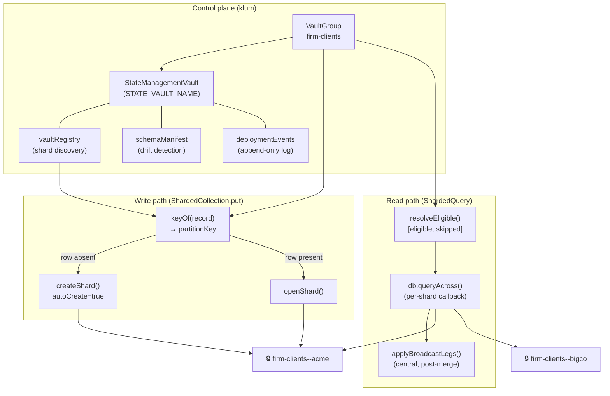

# Federation — partition-federation layer

Technical reference for the `src/federation/` implementation. Issue #9.

See [architecture.md](architecture.md) for the control-plane / data-plane boundary and the one-way klum→noy law. See [docs/glossary/schema-migration.md](glossary/schema-migration.md) for the Transform → Cutover → Rollout vocabulary. The runnable showcase for this guide is `__tests__/federation-showcase.test.ts`.

---

## Overview

The federation layer partitions data across a fleet of sovereign `@noy-db` vaults and provides transparent write routing, fan-out reads, distributed aggregation, cross-vault joins, reactive live queries, federated retrieval, Insight Vault derivations, and fleet schema migration. All cross-vault orchestration runs over the `@noy-db/hub/kernel` seam — never hub internals.

**Entry point:** `createLobby(db)` → `lobby.openVaultGroup(name, opts)` → `VaultGroup<T>`.



---

## 1. VaultGroup + sharding + transparent routing

**Source:** `src/federation/vault-group.ts:79`

### Setup

```typescript
const lobby = createLobby(db)

lobby.withVaultTemplate('client-template', {
  version: 1,
  configure(vault) {
    vault.collection<Customer>('customers')
    vault.collection<Invoice>('invoices', { refs: { customerId: ref('customers') } })
  },
})

const group = await lobby.openVaultGroup<Invoice>('firm-clients', {
  // registry — if omitted, the StateManagementVault's built-in vaultRegistry is used.
  //            Pass an explicit Collection<VaultRegistryRow> to bring your own.
  sharding: {
    keyOf: (r) => r.clientId,        // extract the partition key from a record
    vaultTemplate: 'client-template',
    autoCreate: true,                 // stamp a new shard inline on first write to an unknown key
    // regionOf: (r) => r.region,    // optional data-residency guard (§ 1.3 below)
  },
  cutoverOnOpen: false,               // true → run inline cutover when opening a stale shard
  meta: { label: 'Firm Clients' },    // descriptive only; surfaced via group.meta / federationMeta()
})
```

`withVaultTemplate` registers a `VaultTemplate` (`src/federation/types.ts:37`) by name. The template's `configure` function is re-applied to every shard handle so all shards carry identical collections, indexes, and schema.

### Shard naming

| Concept | Value / rule |
|---|---|
| Shard vault id | `${groupName}--${partitionKey}` (e.g. `firm-clients--acme`) |
| Separator | `--` (reserved; cannot appear in group name or partition key) |
| Partition key charset | `[A-Za-z0-9._-]`, non-empty, no `--` |
| Registry key | Identical to shard vault id (`registryId ≡ shardVaultId`) |
| Reserved name | `STATE_VAULT_NAME` cannot be used as a group name or partition key |

### Write routing — `ShardedCollection.put`

`vault-group.ts:538`

```
ShardedCollection.put(id, record)
├─ sharding.keyOf(record) → partitionKey
├─ registry.get(registryId(partitionKey))
│   ├─ row present → openShard(partitionKey) → Vault
│   └─ row absent
│       ├─ autoCreate === false → UnknownShardError
│       └─ autoCreate (default true) → createShard(partitionKey[, region?]) → Vault
└─ vault.collection(name).put(id, record)
```

`createShard` (`vault-group.ts:193`) is idempotent:

| State | Result |
|---|---|
| row + vault present | return existing handle (no-op) |
| row present, vault deleted | `ShardProvisioningError` |
| row absent | `db.openVault(shardVaultId)` → `template.configure(vault)` → write registry row → emit `shard-created` event |

### Data-residency guard

`types.ts:63` — `sharding.regionOf?: (record) => string`. When set, `createShard` resolves the candidate backend's declared `capabilities.region` and throws `DataResidencyError` if it does not match. Advisory until a region annotation is declared on the backing store; pair with `routeStore({ vaultRoutes })` and a region-encoded partition key (e.g. `eu-acme`).

### `resolveEligible`

`vault-group.ts:255` — called before every fan-out read and Insight refresh. For each registry row in this group:

1. Drop rows with `schemaVersion < options.minVersion` → skip reason `'schema-drift'`
2. Probe each remaining vault's provisioning status; catch backend errors
3. Return `{ eligible: VaultRegistryRow[], skipped: SkippedVault[] }`

A `SkippedVault` carries `reason: 'schema-drift' | 'error' | 'no-grant'`. An unreachable shard is recorded as `'error'` and never propagates — the fleet continues reading the other shards. Pass `failFast: true` to re-throw the first per-shard error instead.

---

## 2. StateManagement Vault — the control-plane vault

**Source:** `src/federation/state-vault.ts:26`

The StateManagement Vault is the reserved `STATE_VAULT_NAME` vault. When `openVaultGroup` is called without an explicit `registry` option, `StateManagementVault.open(db)` runs automatically, records the schema manifest, and attaches the instance to the group.

```typescript
// Direct access (e.g. for migration status inspection):
const sv = await lobby.openStateManagementVault()
// Or: StateManagementVault.open(db)
```

### Collections

| Accessor | Physical collection | Purpose |
|---|---|---|
| `sv.registry` | `vaultRegistry` | Source of truth for shard discovery — one `VaultRegistryRow` per provisioned shard |
| `sv.schemaManifest` | `schemaManifest` | Per-template blueprint fingerprint at each version (drift detection) |
| `sv.queryEvents()` | `deploymentEvents` | Append-only log: `shard-created`, `migration-started/completed/failed`, etc. |
| *(private)* | `migrationStatus` | Per-shard fleet-migration progress (`MigrationStatusRow`) |
| *(private)* | `surfaces` | FR-7 bilateral sync agreements (`SurfaceRow`) |

### Schema manifest

`state-vault.ts:133` — `recordManifest(templateName, template)` captures the template's blueprint (collection names, indexes, `persistJsonSchema` flags) and stores a sha256 fingerprint keyed by `${templateName}:${version}`. `detectDrift` (`state-vault.ts:155`) compares the live fingerprint to the stored one, surfacing shape changes made without a version bump.

### Events — `appendEvent`

`state-vault.ts:121` — writes to the `deploymentEvents` collection with a fresh ULID key. Events are write-through to the in-memory cache; `sv.queryEvents().toArray()` reads from cache synchronously. Callers wrap `appendEvent` in try/catch — event failures are never fatal to the operation.

### `group.meta` and `federationMeta()`

`vault-group.ts:87` — `meta` (`GroupMeta`, alias for `VaultMeta`) is the group-level descriptor (label / description / icon). It is stored on the `VaultGroup` instance; it does not affect routing.

`vault-group.ts:141` — `group.federationMeta()` returns a `FederationMeta`: the group's `meta` plus each member vault's `vaultMeta` (collected via `vault.getMeta()`, best-effort — a shard that fails to open contributes `meta: undefined`). Member meta is transient: noy-db sets it at `openVault` and does not persist it.

---

## 3. Cross-shard queries and surfaces

**Sources:** `src/federation/vault-group.ts`, `src/federation/aggregate-across.ts`, `src/federation/cross-vault-live.ts`, `src/federation/retrieve-across.ts`, `src/federation/partial-reduce.ts`

`group.collection(name)` returns a `ShardedCollection<T, R>`, which is the entry point for all reads and writes.

### `ShardedQuery` — construction

`vault-group.ts:571`

`collection.query()` returns a `ShardedQuery`. All builder methods — `where`, `crossShardJoin`, `broadcastJoin` — return new `ShardedQuery` instances. The query carries no mutable state.

```typescript
const q = group.collection<Invoice>('invoices')
  .query()
  .where('status', '==', 'overdue')
```

`FanoutQueryOptions` (accepted by all terminal methods):

| Option | Type | Default | Effect |
|---|---|---|---|
| `minVersion` | `number` | — | Skip shards below this template version |
| `concurrency` | `number` | `1` | Max shards queried in parallel inside `queryAcross` |

### `.toArray(options?)` → `FanoutResult<R>`

`vault-group.ts:707`

Fan-out: `resolveEligible()` → `db.queryAcross(eligibleVaultIds, callback)`. Each shard's callback: `template.configure(vault)`, `list()` to hydrate the collection and any co-partitioned join targets, apply `where` clauses, run co-partitioned joins via intra-vault `.join()`, return `q.toArray()`. After all shards complete, `applyBroadcastLegs` runs centrally. Returns `{ results: R[], skippedVaults }`.

### `.live(options?)` → `CrossVaultLiveQuery<R>`

`vault-group.ts:732` — backed by `CrossVaultLive<{ records, skipped }>` (`cross-vault-live.ts:18`).

Subscribes to `db.on('change')`, filters by `e.collection === collectionName && e.vault.startsWith(groupName + '--')`, and re-runs `fanoutRecords + applyBroadcastLegs` on any relevant change. Microtask-coalesced by default; set `debounceMs` for reset-debounce coalescing. Single-flight: a recompute in progress marks dirty and reschedules. Call `.stop()` to release the change subscription.

```typescript
const lq = group.collection('invoices').query().where('status', '==', 'overdue').live()
await lq.ready                // initial snapshot computed
lq.value                      // readonly R[]
lq.skippedVaults              // readonly SkippedVault[]
lq.error                      // Error | null
lq.subscribe(() => { ... })   // callback on every update
lq.stop()
```

**v1 limitation:** recomputes only on writes to the primary (left) collection. Writes to a co-partitioned right collection or broadcast-dimension collection do not trigger a recompute.

### `.aggregate(spec)` → `CrossVaultAggregation`

`vault-group.ts:772`, `aggregate-across.ts:48`

**Distributed partial-reduce** is used by `.aggregate(spec).run()` when:

1. No join legs are present (the `aggregateSource()` returns `this`, which exposes `fanoutReduce`)
2. Every reducer in `spec` exposes the `merge` seam — `canPartialReduce(spec)` (`partial-reduce.ts:28`) returns `true`

All standard aggregators from `@noy-db/hub/aggregate` (`sum`, `count`, `avg`, `min`, `max`) expose `merge`. A custom reducer without `merge` forces the central-reduce fallback. The result is identical either way.

**Distributed path:**

```
ShardedQuery.fanoutReduce(spec)                   (vault-group.ts:679)
  per-shard callback: reduceToPartial(rows, spec)  (partial-reduce.ts:33)
  → PartialState[]

central: mergePartials(spec, partials)             (partial-reduce.ts:49)
         finalizePartial(spec, merged)             (partial-reduce.ts:61)
  → AggregateResult<Spec>
```

**Central-reduce fallback** (join legs present, or any reducer lacks `merge`):

```
fanoutRecords() → union of all shard rows
reduceRecords(rows, spec) → AggregateResult<Spec>
```

`.aggregate(spec).live(options?)` always uses central-reduce (`aggregate-across.ts:69`).

### `.groupBy(field).aggregate(spec)` → `CrossVaultGroupedAggregation`

`vault-group.ts:777`, `aggregate-across.ts:98` — always central-reduce: fans out all rows, then runs one `groupAndReduce` call centrally. Returns `{ results: GroupedRow<F, Spec>[], skippedVaults }`.

`.groupBy().aggregate().live()` is also supported (`aggregate-across.ts:117`).

### `.retrieve(query, opts?)` — cross-vault federated retrieval

`vault-group.ts:566` → `src/federation/retrieve-across.ts:16`

Scatter-gather: each eligible shard runs its own trusted-tier `retrieve()`. Per-vault ranked lists are RRF-fused by rank only — no cross-vault retrieval statistics cross the DEK boundary. Every hit carries its originating `vault` id. An unreachable, schema-drifted, or un-indexed shard is skipped (`skippedVaults`); pass `failFast` to re-throw.

`FederatedRetrieveOptions` extends `FanoutQueryOptions`:

| Option | Default | Description |
|---|---|---|
| `mode` | — | `'lexical' \| 'semantic' \| 'hybrid'` |
| `limit` | — | Per-vault and final limit |
| `minScore` | — | Minimum relevance score |
| `fields` | — | Field projection |
| `match` | — | `'any' \| 'all'` |
| `prefix` | — | Prefix search |
| `snippetWindow` | — | Snippet extraction window |
| `includeRecord` | — | Attach the full record to each hit |
| `where` | — | Payload filter applied per-vault (rebuilt into each shard's `within`) |
| `rrfK` | `60` | RRF constant |
| `failFast` | `false` | Re-throw the first per-shard error |

Returns `{ hits: FederatedRetrieveHit<R>[], skippedVaults }`. `FederatedRetrieveHit<R>` extends `RetrieveHit<R>` with a `vault` field.

---

## 4. Cross-shard joins

**Source:** `src/federation/cross-shard-join.ts`

Two join strategies are available on `ShardedQuery`. Both return new `ShardedQuery` instances (chainable). For the boundary rationale (co-partitioned vs. broadcast) see [docs/crossshardjoin-boundary.md](crossshardjoin-boundary.md) (issue #11).

### Co-partitioned join — `.crossShardJoin(field, opts)`

`vault-group.ts:591`

Each shard runs the intra-vault `.join(field)` from noy-db against its own same-vault right collection. The right collection is resolved via the `ref()` declaration on the template's collection options. The join runs inside each shard's `queryAcross` callback; results are unioned after all shards complete.

A `ref()` declaration is required on the template's collection. Absence is detected up-front by probing the first eligible shard (`vault-group.ts:627`) and throws a single `CrossShardJoinError` rather than N per-shard failures.

**`CrossShardJoinOptions`:**

| Option | Required | Description |
|---|---|---|
| `as` | yes | Alias key under which the joined record attaches |
| `maxRows` | no | Per-shard row ceiling (forwarded to intra-vault `.join()`) |
| `strategy` | no | Planner hint (forwarded) |

### Broadcast join — `.broadcastJoin(field, opts)`

`vault-group.ts:603`, `cross-shard-join.ts:99`

Enriches every merged row from a single shared dimension collection (an opened `Collection` handle in another vault). The source is snapshotted once via `from.list()`, indexed by `on` (default `'id'`), then applied centrally: each merged row gets `{ [as]: match ?? null }`. The dimension snapshot is taken after all shards fan out.

Miss behavior: `mode: 'warn'` (default) attaches `null` and emits a one-shot `console.warn`; `mode: 'cascade'` silently attaches `null`.

**`BroadcastJoinOptions`:**

| Option | Required | Default | Description |
|---|---|---|---|
| `as` | yes | — | Alias key |
| `from` | yes | — | A `BroadcastSource` (any object with `list(): Promise<readonly unknown[]>`) |
| `on` | no | `'id'` | Right-side key to match against `field` |
| `mode` | no | `'warn'` | `'warn' \| 'cascade'` |

### Joins + aggregate / live (issue #14)

Both join strategies compose with `.aggregate()` and `.live()`. Co-partitioned joins in `.aggregate()` force central-reduce: `aggregateSource()` (`vault-group.ts:761`) detects join legs and returns a `toArray`-backed source with no `fanoutReduce` method, preventing the distributed path. `.live()` recomputes only on writes to the primary (left) collection.

---

## 5. Cross-vault derivations — Insight Vault

**Source:** `src/federation/vault-group.ts:321`, `src/federation/insight-auto-push.ts`

The Insight Vault pattern derives per-shard summaries into a separate analytics vault. Each shard's source records are decrypted and reduced in-process under `this.db`'s keyring; only the aggregate summary row is written into the Insight Vault — re-encrypted under that vault's own DEK. The shard's raw ciphertext never crosses a DEK boundary.

**DEK boundary note:** the Insight Vault backend sees aggregated structure (totals, counts, timestamps) from many shards — a weaker ZK profile than the per-shard vaults. Opt-in; keep summaries to aggregate scalars (no embeddings, no raw records). See [docs/insight-vault-zk-profile.md](insight-vault-zk-profile.md) (issue #10) for the full boundary analysis.

### Registration — `withCrossVaultDerivation(spec)`

`vault-group.ts:321`

```typescript
group.withCrossVaultDerivation<Invoice, ClientSummary>({
  source: 'invoices',                           // collection read from each shard
  target: {
    vault: 'firm-insights',                     // must NOT be the group or its shards
    collection: 'client-summary',
  },
  derive: (records, ctx) => ({                  // called once per eligible shard
    partitionKey: ctx.partitionKey,             // ctx: { vaultId, partitionKey, schemaVersion }
    totalRevenue: records.reduce((s, r) => s + r.amount, 0),
    invoiceCount: records.length,
  }),
  // autoPush: true,
  // autoPush: { debounceMs: 500, minVersion: 2 },
})
```

`target.vault` cannot equal the group name or any shard vault id (would breach the per-shard DEK isolation). Violation throws `ValidationError` at registration time — `vault-group.ts:325`.

Multiple derivations can be registered on the same group. `refreshInsights` runs all of them per eligible shard.

### Refresh — `refreshInsights(options?)` / `refreshDerivation(pk)`

`vault-group.ts:367`, `vault-group.ts:412`

`refreshInsights` runs `resolveEligible`, then for each registered derivation:
1. Reads the shard's `source` collection via `db.queryAcross`
2. Calls `derive(records, ctx)`
3. Writes the summary row into the Insight Vault keyed by `partitionKey`

Returns `{ written: number, skippedVaults: SkippedVault[] }`. A shard that errors during read is skipped (its prior summary is left intact); pass `failFast: true` to re-throw. `refreshDerivation(pk)` is a convenience wrapper for `refreshInsights({ only: [pk] })`.

### Auto-push — `autoPush: boolean | InsightAutoPushConfig`

`vault-group.ts:333`, `insight-auto-push.ts`

When enabled on any derivation, the group subscribes to `db.on('change')`. The `InsightAutoPush` controller (`insight-auto-push.ts`) calls `noteWrite(partitionKey, collection)` on every write to a vault with the group's prefix. Writes to `source` collections are coalesced and trigger `_recomputeShardInsights(partitionKey)` — best-effort (failures go to `console.warn`).

**`InsightAutoPushConfig`:**

| Option | Description |
|---|---|
| `debounceMs` | Reset-debounce window; omit for microtask coalescing (default) |
| `minVersion` | Skip auto-pushing shards below this schema version |

Await `group.whenInsightsSettled()` (`vault-group.ts:442`) to drain all pending flushes, e.g. after a batch write in tests.

---

## 6. Fleet migration

**Source:** `src/federation/vault-group.ts:462`

See [docs/glossary/schema-migration.md](glossary/schema-migration.md) for the full Transform → Cutover → Rollout vocabulary. The federation layer owns the **Rollout** tier (fleet orchestration); the per-vault **Cutover** (drain-barrier + Transform) stays in noy-db.

### `cutoverShard(partitionKey)` → `MigrationStatusRow`

`vault-group.ts:462` — migrates one shard to the template's `version`:

1. Read the shard's registry row; if `schemaVersion >= template.version` → return `status: 'done'` (no-op).
2. Write `status: 'running'` + append `migration-started` event.
3. `_openShardRaw(partitionKey)` (bypasses `cutoverOnOpen` recursion guard), `vault._drainPendingSchemaWrites()`, `vault.runSchemaCutover()`.
4. Advance the registry row's `schemaVersion` to the target.
5. Write `status: 'done'` + append `migration-completed` event. Return the `MigrationStatusRow`.

Never throws on cutover failure — writes `status: 'failed'` and returns so a fleet run continues past a bad shard.

### `rolloutSchema(options?)` → `SchemaRolloutResult`

`vault-group.ts:509` — active batch runner. Finds all shards with `schemaVersion < template.version`, runs `cutoverShard` in controlled batches.

| Option | Default | Description |
|---|---|---|
| `cohort` | — | Restrict to these partition keys (canary / staged rollout) |
| `batchSize` | `4` | Max shards migrated concurrently per batch |

Batches run sequentially; shards within a batch run in parallel. Resumable: a re-run after a crash re-reads the registry and only picks up shards still behind the target version.

Returns `{ target: number, migrated: string[], failed: { vaultId, error }[] }`.

### `cutoverOnOpen: boolean`

`VaultGroupOptions.cutoverOnOpen` — when `true`, `openShard` compares the registry `schemaVersion` to the template version and runs `cutoverShard` inline if the shard is stale, before surfacing the vault handle. Zero cost for shards never opened in that process. Default `false`; use `rolloutSchema` for explicit fleet-wide runs.

---

## Runnable showcase

`__tests__/federation-showcase.test.ts` exercises all six sections above in a single `beforeAll`-seeded harness with an in-memory store: creates a `firm-clients` group with two shards (`acme`, `bigco`), seeds customers and invoices, then verifies fan-out query, distributed aggregate, co-partitioned `crossShardJoin`, Insight Vault refresh, and the StateManagement Vault manifest + registry.

```
corepack pnpm exec vitest run __tests__/federation-showcase.test.ts
```

---

## Class and type reference

| Symbol | Source | Description |
|---|---|---|
| `VaultGroup<T>` | `vault-group.ts:79` | Group handle; holds `db`, `name`, `registry`, `sharding`, `template` |
| `ShardedCollection<T, R>` | `vault-group.ts:531` | Per-collection view over all shards; write + read entry point |
| `ShardedQuery<T, R>` | `vault-group.ts:571` | Lazy cross-shard query; immutable, chainable |
| `ShardedGroupedQuery<T, R, F>` | `vault-group.ts:783` | Intermediate after `.groupBy(field)` |
| `CrossVaultAggregation<R, Spec>` | `aggregate-across.ts:48` | One-shot or live scalar aggregate |
| `CrossVaultGroupedAggregation<R, F, Spec>` | `aggregate-across.ts:98` | One-shot or live grouped aggregate |
| `CrossVaultLive<S>` | `cross-vault-live.ts:18` | Reactive computation core (generic over snapshot type `S`) |
| `StateManagementVault` | `state-vault.ts:26` | Control-plane vault — registry, manifest, events, migration status |
| `PartialState` | `partial-reduce.ts:25` | Opaque per-spec-key reducer state from one shard |
| `VaultTemplate` | `types.ts:37` | `{ version: number; configure: (vault: Vault) => void }` |
| `VaultRegistryRow` | `types.ts:43` | One row per shard: `vaultId`, `partitionKey`, `templateName`, `schemaVersion`, `group` |
| `ShardingConfig<T>` | `types.ts:54` | `keyOf`, `vaultTemplate`, `autoCreate?`, `regionOf?` |
| `CrossVaultDerivationSpec<R, S>` | `types.ts:215` | Insight Vault derivation: `source`, `target`, `derive`, `autoPush?` |
| `CrossVaultDerivationContext` | `types.ts:186` | Per-shard context passed to `derive`: `vaultId`, `partitionKey`, `schemaVersion` |
| `InsightAutoPushConfig` | `types.ts:196` | `debounceMs?`, `minVersion?` |
| `RefreshInsightsResult` | `types.ts:233` | `{ written: number, skippedVaults: SkippedVault[] }` |
| `MigrationStatusRow` | `types.ts:289` | Per-shard cutover progress: `status`, `currentVersion`, `targetVersion`, `error?` |
| `SchemaRolloutResult` | `types.ts:94` | `{ target, migrated: string[], failed: { vaultId, error }[] }` |
| `SkippedVault` | `types.ts:113` | `{ vaultId, reason: 'schema-drift' \| 'error' \| 'no-grant', error? }` |
| `FanoutResult<R>` | `types.ts:119` | `{ results: R[], skippedVaults }` |
| `FederatedRetrieveResult<R>` | `types.ts:148` | `{ hits: FederatedRetrieveHit<R>[], skippedVaults }` |
| `FederationMeta` | `types.ts:21` | `{ meta: GroupMeta \| undefined, vaults: [...] }` |
| `GroupMeta` | `types.ts:18` | Alias for `VaultMeta` (label / description / icon) |
